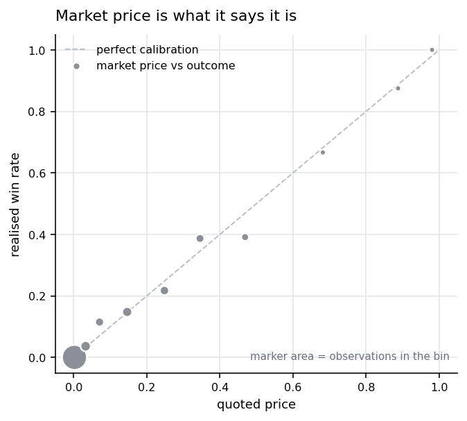
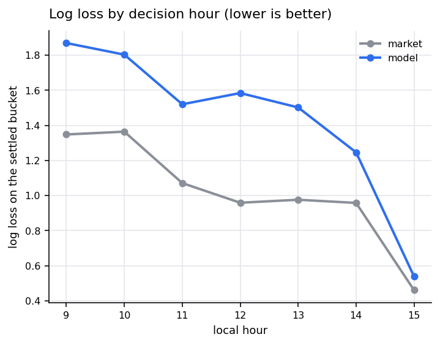
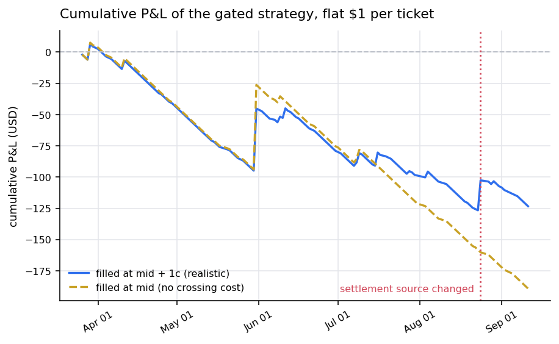

# weather-market-lab

[](https://github.com/qkkqk1234/weather-market-lab/actions/workflows/ci.yml)
[](LICENSE)

[中文](README.zh.md)

A reproducible harness for **daily-high-temperature prediction markets** — the
ones that ask "what will the highest temperature in city X be today?" and settle
against a public weather station.

Data pipeline, a calibrated baseline model, a leakage-audited walk-forward
backtester, a risk gate, and the results — including the negative ones, which
are most of them. Plus, in [§5](#5-where-to-look-instead), a map of the three
places an edge could still be, and which of them are already closed.

> **Finding.** Over 174 settled days this market prices its buckets well. The
> baseline model does not beat it at any decision hour, and a gated strategy
> trading the disagreement came out at 14 winners against the 16.7 the market's
> own prices predicted (z = −0.70). There is no edge here to report. A language
> model given the same observations does not beat the frequency table either —
> [§7](#7-the-evaluation-this-repo-exists-for), on 360 scored forecasts.

Everything below regenerates from a 600 KB bundled snapshot in about two
minutes.

## Results

### 1. The market is calibrated

Every quote at local 09:30 / 12:30 / 15:30, binned by price against how often
those buckets won. `se` is the standard error under "the quoted price is the
truth".

| price band | n | mean price | realised | gap | se | z |
|---|---:|---:|---:|---:|---:|---:|
| 0.00–0.02 | 2715 | 0.002 | 0.000 | −0.19 pp | 0.09 | −2.07 |
| 0.02–0.05 | 328 | 0.033 | 0.037 | +0.38 pp | 0.98 | +0.39 |
| 0.05–0.10 | 243 | 0.071 | 0.115 | +4.43 pp | 1.65 | +2.69 |
| 0.10–0.20 | 304 | 0.146 | 0.148 | +0.15 pp | 2.03 | +0.08 |
| 0.20–0.30 | 262 | 0.248 | 0.218 | −3.09 pp | 2.67 | −1.16 |
| 0.30–0.40 | 230 | 0.346 | 0.387 | +4.13 pp | 3.14 | +1.32 |
| 0.40–0.60 | 184 | 0.469 | 0.391 | −7.77 pp | 3.68 | −2.11 |
| 0.60–0.80 | 57 | 0.682 | 0.667 | −1.51 pp | 6.17 | −0.24 |
| 0.80–0.95 | 64 | 0.888 | 0.875 | −1.26 pp | 3.95 | −0.32 |
| 0.95–1.00 | 77 | 0.981 | 1.000 | +1.95 pp | 1.57 | +1.24 |



Three bands pass 2σ, which is noise across ten tests, not three findings: the
signs alternate between neighbours, whereas a real favourite-longshot effect is
monotone in price. The sub-cent band is dead buckets, which cannot be shorted
profitably at 0.002 anyway.

### 2. The model loses to the market at every hour

Model refit before each day; market distribution is its own mids renormalised
to 1. Current settlement regime only.

| local hour | n | model log loss | market log loss | model top-1 | market top-1 |
|---:|---:|---:|---:|---:|---:|
| 09 | 16 | 1.869 | **1.348** | 31.2% | **37.5%** |
| 10 | 16 | 1.803 | **1.364** | 12.5% | **43.8%** |
| 11 | 15 | 1.520 | **1.071** | 40.0% | **46.7%** |
| 12 | 14 | 1.584 | **0.959** | 28.6% | **64.3%** |
| 13 | 14 | 1.502 | **0.976** | 42.9% | **50.0%** |
| 14 | 14 | 1.246 | **0.958** | 50.0% | **64.3%** |
| 15 | 14 | 0.539 | **0.461** | **85.7%** | 78.6% |



**n is 14–16 days** — the whole regime since the source change. The direction is
consistent at every hour and matches the trading result below; the magnitudes
are not precise.

### 3. The gate, run over recorded prices

Walk-forward, refit before every day, fills at mid + 1 cent, hold to
resolution, flat $1 per ticket, ≤ 2 tickets a day, entries before noon.

| regime | days | trades | ROI | wins | expected | z |
|---|---:|---:|---:|---:|---:|---:|
| Weather Underground (03-23 → 08-23) | 135 | 252 | −50.2% | 12 | 15.1 | −0.86 |
| NOAA / Bao'an METAR (08-24 → 09-11) | 15 | 26 | +12.5% | 2 | 1.6 | +0.38 |
| **combined** | **150** | **278** | **−44.4%** | **14** | **16.7** | **−0.70** |



*Expected* is the sum of the market's own quoted probabilities for exactly the
tickets bought. z = −0.70 is not evidence of anything either way. Result 2 is
the better-powered statement.

**How to read the ROI, and how not to.** Mean ticket price is $0.07, so one
2-cent winner swings ROI by tens of points. On 280 longshot tickets the ROI
estimate is mostly noise: the same gate filled at the mid, with no crossing
cost at all, comes out at −62.2% because a different handful of tickets happens
to win. Read the win-count z, not the ROI.

### 4. A silent resolution-source change

On 2026-08-24 this market changed which thermometer decides it — a coastal
station in Hong Kong for an airport 30 km away — with no announcement. Same
title, same buckets. `studies/04` finds it from outcomes alone:

| candidate source | before | after |
|---|---:|---:|
| Weather Underground page (Lau Fau Shan sensor) | **82%** (n=154) | — |
| HKO Lau Fau Shan, official daily max | 67% (n=153) | — |
| HKO Wetland Park, 4 km away | 40% (n=153) | — |
| Shenzhen Bao'an METAR (ZGSZ) | **23%** (n=155) | **100%** (n=19) |

A constant offset does not patch it: `METAR − WU print` has a median of −1 but
ranges from −4 to +4 across 146 overlapping days, and the buckets are 1°C wide.

This also explains result 2. The old arrangement had a latency edge — the
settling sensor published 1-minute readings 40–60 minutes ahead of the hourly
number the market resolved on. The new one has none: the METAR reading *is*
both the settlement and the fastest public feed of it. Full write-up:
[docs/silent-source-change.md](docs/silent-source-change.md).

### 5. Where to look instead

`studies/05` scans the three places an edge could still structurally exist.

**A. Impossible buckets.** The day's high only goes up, so a bucket entirely
below the running max is worth exactly zero — free money, no forecast needed.
Here: **1 quote out of 719** was still above a cent. Closed. Worth re-running on
a thinner market, since the scan costs nothing.

**B vs C. The decided-but-unpriced window.** This is the live one.

| local hour | already decided (hindsight) | winner's median quote | ≤ 0.90 | cheapest | cooling rule fires | correct | its median quote |
|---:|---:|---:|---:|---:|---:|---:|---:|
| 11:30 | 3 | 0.750 | 3 | 0.450 | 1 | 0 | 0.360 |
| 12:30 | 5 | 0.770 | 3 | 0.500 | 1 | 0 | 0.363 |
| 13:30 | 6 | 0.925 | 3 | 0.420 | 0 | — | — |
| 14:30 | 7 | 0.875 | 5 | 0.480 | 1 | 1 | 0.975 |
| 15:30 | 12 | 0.915 | 6 | 0.330 | 1 | 1 | 0.995 |
| 16:30 | 14 | 0.990 | 3 | 0.665 | 1 | 1 | 0.997 |
| 17:30 | 14 | 0.995 | 1 | 0.770 | 2 | 2 | 1.000 |
| 18:30 | 14 | 0.999 | 0 | 0.960 | 4 | 4 | 1.000 |

Left half: days where the high was *in fact* already set, and what the eventual
winner was still quoted at. Right half: a cooling rule that uses no hindsight —
two consecutive reports at least 2°C below the running max, no rebound, max set
at least two hours ago.

The rule is accurate from 13:00 on (13 firings, 13 correct; before 13:00 it
fires on morning bumps and was wrong both times, so it needs a time floor). But
**by the time it fires, the winner is quoted at 0.97+**. On the same days, one
to three hours earlier, the answer was already physically fixed and the winner
was buyable between 0.33 and 0.90.

**That gap is the opportunity, and it is not a forecasting problem.** It needs
evidence that the temperature *cannot* rise further, an hour or two before an
hourly-integer cooling rule can see it — a finer or faster feed of the same
station, a sea breeze front in the wind record, a cloud deck arriving on
satellite. That is a much narrower question than "what will the high be", and
it is the one the market is still visibly wrong about.

Counts here are single digits per hour. This is a map of where to dig, not
evidence that there is anything at the bottom.

### 6. Second study: the same window across 51 cities

[`latelock/`](latelock/) chases exactly that window at scale, and finds the
other binding constraint. The weather signal is solid — 21 of 51 cities clear a
97% stability bound. But across 378 city-days with a strict signal, **2** had a
buyable print in the 0.90–0.95 band. The discount exists; the capacity does not.

So the full picture: the morning is efficiently priced, the late afternoon is
efficiently priced once the lock is obvious, and the hours in between are where
both the mispricing and the difficulty live.

### 7. The evaluation this repo exists for

§5 says the market is wrong for one to three hours about whether the day is
already over. `studies/06` is the benchmark for anything that would close that.

**Task.** At local hour h, given the day's published METAR trace and nothing
else: how much higher will the day finish above the running max already
observed? Four outcomes — `0` (the day is over), `1`, `2`, `3+`.

Three predictors, identical days, identical outcomes, scored on log loss:

| local hour | n | unconditional | empirical table | deepseek-chat |
|---:|---:|---:|---:|---:|
| 13 | 120 | **0.8651** | 0.8783 | 1.1342 |
| 14 | 120 | 0.6520 | **0.5997** | 0.9443 |
| 15 | 120 | 0.5176 | **0.3632** | 0.5771 |

**The language model loses to the frequency table at every hour**, on 360
scored forecasts costing $0.08. Not close at 13:00 and 14:00; at 15:00 it is
beaten by a table that knows only the hour.

Why, in one table — mean probability each predictor assigned to "the day is
already over", against how often it actually was:

| | 13:00 | 14:00 | 15:00 |
|---|---:|---:|---:|
| **what actually happened** | **0.650** | **0.792** | **0.925** |
| empirical table | 0.658 | 0.788 | 0.864 |
| deepseek-chat | 0.334 | 0.474 | 0.591 |
| claude-sonnet-5 (pilot, n=10/hr) | 0.319 | 0.323 | 0.385 |

**Both models are badly under-confident, and they barely move with the clock.**
The true rate climbs from 0.65 to 0.93 through the afternoon; DeepSeek goes
0.33 → 0.59, Sonnet is nearly flat at a third. They hedge exactly where hedging
is wrong. It is not that they cannot read the trace — they are shown every
hourly observation, including the one that says the temperature peaked two
hours ago — it is that nothing anchors them to the diurnal base rate.

#### The baseline had the same disease, and fixing it is instructive

The first version of the table sat at 0.608 / 0.639 / 0.672 against that same
0.650 / 0.792 / 0.925 — under-confident in the same direction, for a concrete
reason: its features were rise, dewpoint spread and cloud cover, and **none of
them can express "the temperature is already two degrees below today's peak".**
Measured across 2,732 warm-season days, that one field separates the outcome
more than the other three together:

| | gap 0 | gap 1 | gap 2+ |
|---|---:|---:|---:|
| P(the high is already in), 13:00 | 0.630 | 0.875 | 0.930 |
| P(the high is already in), 15:00 | 0.919 | 0.978 | 0.993 |

Adding it moved the table to 0.658 / 0.788 / 0.864 and turned it from *losing*
to its own unconditional control at every hour into beating it at 14:00 and
15:00. The models are shown that gap explicitly, in the trace, and still do not
use it.

That is the finding to take away, and it names the next experiment: put the
unconditional hour prior in the prompt and score whether a model can *adjust* a
base rate it is handed, rather than having to rediscover the diurnal cycle on
every call.

The model and the table see exactly the same published observations. The table
compresses them into four binned features; the model gets the raw hourly
sequence including wind direction, which is where a sea breeze would show up.
Prompts withhold the year, so a model cannot in principle recall the actual day.
Replies are cached on disk by prompt hash, so a completed run re-scores for free
and is checkable by someone else.

```bash
python -X utf8 studies/06_llm_vs_baseline.py --dry-run     # print one prompt
python -X utf8 studies/06_llm_vs_baseline.py --estimate    # price it, call nothing
ANTHROPIC_API_KEY=... python -X utf8 studies/06_llm_vs_baseline.py \
    --provider anthropic --days 120
# or, with no API key at all, through a coding-agent CLI you already have:
python -X utf8 studies/06_llm_vs_baseline.py --provider claude-code --days 10
```

**What it costs.** Measured, not guessed: 360 calls at ~512 input and ~60 output
tokens each — about $0.88 on Sonnet, $0.45 on GPT-5, for one model over 120
days at three hours. The study that would actually settle the question is 600
warm-season days × 4 hours × 4 models × 5 samples ≈ 48,000 calls ≈ 25M input
tokens, plus prompt iteration. That is the arithmetic, and it is the reason this
repo has an open question rather than an answer.

**On running it through an agent CLI instead.** `--provider claude-code` and
`--provider codex` work and need no API key, which is handy for a pilot. They
are the wrong tool at scale, for a measured reason:

| path | tokens per call | list price per call |
|---|---:|---:|
| API `/v1/messages` | ~512 in + 60 out | $0.0024 |
| `claude -p`, tools disabled | ~43,000 in + ~500 out | $0.17 |

The agent scaffolding travels with every call and dwarfs a 500-token question —
about 80× the tokens for the same answer. Two traps worth naming, both hit
while building this:

* **These CLIs are agents.** At defaults they run in the directory you launch
  them from with file-editing tools live, and will cheerfully rewrite the
  repository instead of answering. `wxlab.llm.CliProvider` pins tools off, MCP
  off, its own system prompt, and a throwaway working directory.
* **On Windows they are `.CMD` shims.** A prompt passed as an argument goes
  through cmd.exe, which drops embedded newlines, so the observation table
  arrives truncated and the model answers that no data was supplied. The prompt
  goes on stdin.

## Reproduce

```bash
git clone https://github.com/qkkqk1234/weather-market-lab
cd weather-market-lab
pip install -r requirements.txt

python -X utf8 studies/01_market_calibration.py
python -X utf8 studies/02_model_vs_market.py
python -X utf8 studies/03_gated_backtest.py     # ~90s, refits per day
python -X utf8 studies/04_settlement_source.py
python -X utf8 studies/05_where_to_look.py
python -X utf8 studies/06_llm_vs_baseline.py    # no key needed for the baselines
python -X utf8 -m pytest tests/ -q              # 28 tests
```

Everything in `reports/` comes from those six scripts.

## Layout

```
wxlab/       data loaders, public fetchers, model, gate, backtester, LLM layer
studies/     six scripts; every number in this README comes from one of them
latelock/    the 51-city study, its own README and 37 tests
docs/        the source-change post-mortem
data/        bundled snapshot, ~600 KB of plain CSV
```

### The model

At decision hour `h` the running max is known and the day's high can only go
up, so the running max is a hard floor and the only unknown is
`delta = daily_max − temperature_now`. `P(delta)` is an empirical frequency
table over (hour, gap below the running max, 2-hour rise, dewpoint spread,
cloud cover), backing off to coarser cells below 60 observations. Trained on
~2,700 warm-season days from 2014 on. The gap term is worth more than the other
three together — see §7.

Deliberately plain: every number traces to a countable set of past days, which
is what you want when the thing you are testing against may simply be right.

### What keeps the backtest honest

- **Refit per day.** `fit(before=day)` for each trading day, cutoff exclusive,
  asserted by a test.
- **Trade after the report is public.** An hourly METAR valid at `HH:00` is
  published 6–21 minutes later, so a quote sampled at `HH:00` predates the
  reading the model reads. Quotes are therefore sampled at `HH:30`. Getting
  this wrong is a 30-minute look-ahead that flatters the model.
- **Pay to cross.** Quotes are mids; every buy fills at mid + $0.01. The venue
  tick is $0.001, so that is ~10 ticks of adverse fill.
- **No exits.** A loser is held to zero. On a book this thin there is often no
  bid to sell into, so the backtest is not allowed an exit that may not exist.
- **Flat stake.** Sizing is a separate question from whether a signal exists;
  mixing them is how a flat edge starts looking like a compounding one.
- **A settlement tripwire.** One test asserts
  `floor(max hourly METAR) == settled bucket` for every day in the current
  regime. It fails the moment the source moves again.

### The risk gate

| rule | why |
|---|---|
| entries before 12:00 local only | later, the outcome is largely determined and already priced |
| limit price ≤ 0.25 | above that you are buying the market's own opinion |
| tiered safety multiple: <0.02 → 10×, 0.02–0.10 → 4×, 0.10–0.25 → 2× | the cheap end is where a model's tail is least trustworthy |
| $1 per ticket, ≤ 2 tickets/day, no averaging down | sizing is not evidence |
| no stop loss, accept the zero | a thin book may have no bid to sell into |

The last two interact with the venue: with a $1 ticket and a 5-share minimum,
the highest reachable price is $0.20, so the 0.20–0.25 slice is unreachable in
practice.

## Data

| file | rows | what |
|---|---:|---|
| `zgsz_metar_hourly.csv.gz` | 111,232 | ZGSZ hourly METAR (temp, dewpoint, wind, visibility, cloud), 2014-01-01 → 2026-09-12, UTC |
| `shenzhen_events.csv` | 1,947 | bucket definitions and resolved winner, 177 market days |
| `shenzhen_quotes.csv.gz` | 17,483 | mid per bucket at `HH:30` local, 08:30–19:30 |
| `settlement_candidates.csv` | 155 | four candidate stations vs the settled label |

All from public unauthenticated endpoints. Sources and refresh instructions:
[`data/README.md`](data/README.md).

## Scope

A research harness. There is **no order placement path anywhere in it** — no
wallet, no signing key, no exchange client. `wxlab.fetch` issues unauthenticated
GETs and nothing else. Nothing here is investment advice.

## Open question

**Can a language model tell, at 14:00, that the day is already over?**

§5 shows the market is wrong about that for one to three hours. §7 puts the
question to a model on 360 scored forecasts: **no, not yet** — it loses to a
frequency table at every hour, and the reason is a base rate it never anchors
to rather than a trace it cannot read.

It is a better question than "what will the high be": narrower, with a physical
answer, and the evidence a person would use — a sea breeze front in the wind
record, a cloud deck arriving on satellite, the wording of a forecast discussion
— is exactly the kind a frequency table cannot encode and a language model
might.

What is still open is whether that is fixable in the prompt or is a real limit:
hand the model the hour's unconditional prior and score whether it can adjust
it. Every result, positive or negative, is committed to `reports/` with the
response cache, so anyone can re-score without spending anything.

## License

MIT. See [LICENSE](LICENSE).
